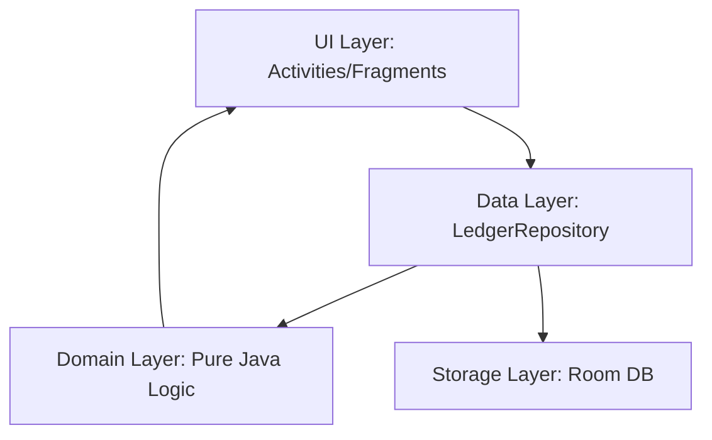

# AI Agent Context & Development Guide — ChiaBill (v0.3.0)

Welcome, AI Agent. This project has pivoted from a React Native template to a **Java Native Android application**. This document provides the essential context to help you navigate the codebase and implement changes consistently.

## 📌 Project Overview

**ChiaBill** is an Android app for splitting shared expenses. It ensures that money calculations are deterministic and perfectly accurate (zero drift), allowing users to settle debts via **VietQR**.

**Current Version:** v0.3.0 (Offline Demo). All accounts exist in one local database for demo purposes.

## 🗺️ Primary Reference Documents

Before making any changes, read these in order:

1.  `AGENTS.md`: This document (Roadmap, rules, and critical constraints).
2.  `architecture.md`: Detailed technical stack, Room schema, and `:domain` logic.
3.  `business-requirements.md`: Functional (FR) and Non-Functional Requirements (NFR) with current implementation status.

---

## 🛠️ Technical Stack & Architecture

### 1. The Stack

#### Android App

- **Language:** Java 17
- **Platform:** Android (minSdk 26, targetSdk 35)
- **Local Storage:** Room 2.6.1 (SQLite)
- **QR Logic:** ZXing (EMVCo TLV for VietQR)
- **Testing:** JUnit 5 (on `:domain` module)

#### Backend (Phase 2 - In Progress)

- **Runtime:** Node.js + Express
- **Database:** SQLite via Sequelize ORM
- **Authentication:** JWT (JSON Web Tokens) & bcryptjs
- **Architecture:** Layered (`routes` $\rightarrow$ `controllers` $\rightarrow$ `services` $\rightarrow$ `models`)

### 2. Layered Architecture (Android)

- **`:domain` Module:** Pure Java. **No Android imports allowed.** Contains all business rules (splitting, ledger, QR codec).
- **`:app` Module:** Android-specific code. Handles UI, Room database, and the `LocalLedgerRepository` implementation.

---

## ⚠️ Critical Development Rules

### 1. Money Handling (The Golden Rule)

- **Data Type:** Use `long` for VND everywhere. **Never** use `double`, `float`, or `BigDecimal` with 2 decimal places for internal calculations.
- **Allocation:** Use the `Allocator` (largest-remainder method) to ensure the sum of shares always equals the total.
- **Shares:** Per-person shares are **recomputed** on the fly from the bill; they are **not** stored in the database.

### 2. Business Logic Placement

- **Logic $\in$ `:domain` or Repository.** Never put money calculations or permission checks inside an `Activity` or `Fragment`.
- **Permissions:** Checks (e.g., "can this user delete this bill?") must happen in `LocalLedgerRepository`, not only in the UI.
- **`:domain` constraint:** The domain module must not import anything from Android.

### 3. Room & Data Stability

- **Split Order:** Split order must use **all members ever in the group** (`AppSnapshot.allMembersOf`). UI and permissions use active members (`membersOf`). Mixing these up will change the calculation of old bills.
- **Database Versions:** If you modify a Room entity, you **must** bump the `AppDatabase` version.
- **Phone Lookup:** Phone lookup is exact match only. No listing or fuzzy search of users.

## ⚙️ Backend Operations

> New to the project? Follow **README.md → "Getting started (app + backend)"** for the full setup, including `BACKEND_URL` and the network security config.

When working on the backend (located in `/backend`), follow these operational rules:

### 1. Running the Server

- **Installation:** Run `npm install` inside the `backend/` directory.
- **Configuration:** Copy `backend/config/config.json.sample` to `backend/config/config.json` and update the credentials.
- **Execution:** Use `npm start` for production or `npm run dev` for development (with nodemon).

### 2. Database Migrations (Mandatory)

Do **not** use `sequelize.sync()`. Use the migration tool to ensure data stability across environments:

- **Apply Migrations:** `npx sequelize-cli db:migrate` (Run this after pulling new code).
- **Rollback Migration:** `npx sequelize-cli db:migrate:undo`.
- **Create Migration:** `npx sequelize-cli migration:generate --name <migration_name>`.

### 3. Development Workflow

- **New Feature:** Create Migration $\rightarrow$ Update Model $\rightarrow$ Implement Service $\rightarrow$ Create Controller $\rightarrow$ Define Route.
- **Money:** Ensure the backend implements the exact same `largest-remainder` allocation as the `:domain` module to prevent drift between client and server.

---

## 🚀 Roadmap

### Phase 1 — offline app (done in v0.3.0)

- [x] Domain: integer-VND split engine (equal, itemised, custom amounts, percentage), VAT/fee, rounding
- [x] Domain: ledger, debt simplifier, payment state machine
- [x] Domain: VietQR encode/parse with CRC, phone numbers, invite codes
- [x] 52 unit/property tests on `:domain`
- [x] Room schema v3, `LedgerRepository` + local implementation, demo data
- [x] Accounts by phone number, groups, add member by phone, invite code, remove member, leave group
- [x] Bills: category, date, 4 split modes, edit/delete with permission checks
- [x] History filters (category, member, period)
- [x] Debt screen with VietQR, save/share QR, notifications, settle-up plan
- [x] Profile: rename, receiving QR (image, camera, paste, manual)

### Phase 1 — still to do

- [ ] Run `connectedDebugAndroidTest` on a device and keep the log
- [ ] Scan a generated QR with a real banking app and record evidence
- [ ] Usability sessions: time to add an expense (NFR3), SUS score (NFR4)

### Phase 2 — multi-device (optional)

- [ ] Choose: Node/Express + JWT (per `architecture.md` §8) or Firebase
- [ ] `RemoteLedgerRepository` (or `FirebaseLedgerRepository`) behind the existing interface
- [ ] Offline queue with `pendingSync`, last-write-wins
- [ ] Real Room migrations instead of destructive fallback

---

## ✅ Definition of Done

- [ ] **Domain Tests:** Any change to split/balance logic must have a corresponding test in `:domain` (`gradlew :domain:test`).
- [ ] **Build Check:** `gradlew :app:assembleDebug` builds successfully.
- [ ] **Requirement Mapping:** The feature maps to an FR in `business-requirements.md` and its status column is updated.
- [ ] **Consistency:** No Android imports in the `:domain` module.

---

## 🛠️ Mobile Deployment Troubleshooting

### Signature Mismatch (`INSTALL_FAILED_UPDATE_INCOMPATIBLE`)

If you see this error while running `./gradlew installDebug`, it means a version of the app was previously installed on the device from a **different machine** (with a different debug signing key).

**The Solution:**
You must completely uninstall the existing app from the device before installing your version.

- **Via Device:** Long-press app icon $\rightarrow$ Uninstall $\rightarrow$ Remove all data.
- **Via Terminal:** `adb uninstall vn.nhom03.chiabill`
