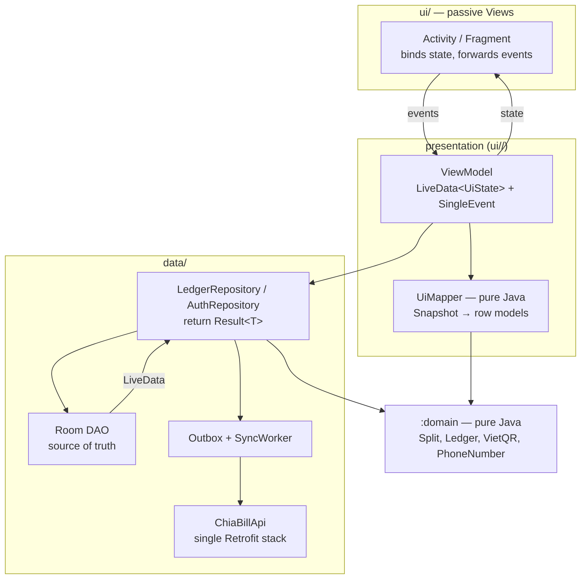

# `:app` Architecture Design — UI and Mobile Logic (ChiaBill)

Scope: the Android `:app` module only (UI layer, presentation logic, data layer, app wiring). `:domain` and `backend/` are referenced but not redesigned. Rules in `AGENTS.md` still apply (integer VND, no money math in UI, permissions in the repository, no Android imports in `:domain`).

---

## 1. Where we are today

```
ChiaBillApp (service locator: repo, authRepo, session, notifications, loading dialog)
  ├─ ui/        9 Activities + 3 Fragments, each reads repo() and does its own rendering/logic
  ├─ data/repo/ LedgerRepository ◄── RemoteLedgerRepository ──wraps──► LocalLedgerRepository ──► Room
  │             AuthRepository   ◄── RemoteAuthRepository
  ├─ data/remote/  ChiaBillApi + ApiClient   (Retrofit, ledger endpoints)
  ├─ data/network/ AuthApi + NetworkClient   (Retrofit, auth endpoints)
  └─ util/      SessionManager, Nav, Ui, QrImages, QrExport, NotificationHelper, i18n/MessageMapper
```

What works and is worth keeping:

- One `LedgerRepository` interface as the only door for UI → data.
- `AppSnapshot`: immutable, pre-computed ledger, `allMembersOf` vs `membersOf` split already encoded.
- ViewBinding, Material, Room LiveData, `BillEditViewModel` for rotation survival.
- Domain stays pure and is where money math lives.

Problems found in the code (these drive the design):

| # | Problem | Evidence | Consequence |
|---|---|---|---|
| P1 | **Presentation logic lives in Activities** | `GroupDetailActivity` (497 lines) imports `Ledger`, `Money`, `SplitResult`, `ShareLine`, holds filter state (`filterCategory/Member/Period`) as fields; `BillEditActivity` 431 lines | Hard to unit test; breaks the "no money calc in Activity" rule in spirit; filters reset on process death |
| P2 | **No ViewModel per screen**; each screen observes the whole `AppSnapshot` and re-derives its view | `DebtsFragment.render`, `MainActivity.render` | Every table change re-renders every screen; duplicated filtering/mapping code |
| P3 | **Callback pairs with string errors** (`Callback<T>` + `Callback<String> onError`) | every method of `LedgerRepository`; `"INVALID_TOKEN"` magic string in `AuthRepository` | No typed error handling, UI cannot distinguish offline/forbidden/validation; messages hard-coded in repo ("Registration failed: …") |
| P4 | **Remote repo is online-first write-through with no outbox** | `RemoteLedgerRepository.addMember`: HTTP call, then `localRepo.addMember` | Offline = every write fails; roadmap calls for `pendingSync` + last-write-wins but nothing models it |
| P5 | **Two executors and two Retrofit stacks** | `LocalLedgerRepository.io`, `RemoteLedgerRepository.executor`; `data/network` and `data/remote` | Races between local and remote writes; duplicated base URL/auth/interceptor config |
| P6 | **App-level `ProgressDialog` holding an Activity** | `ChiaBillApp.showLoading(Activity)` | Deprecated API, leak risk on rotation, loading state is not part of screen state |
| P7 | **Session/auth side effects in infrastructure** | `ApiClient` interceptor calls `session.signOut()` and `startActivity(LoginActivity)` | UI navigation from the network layer; every Activity repeats `requireUser()` / `userMissing()` |
| P8 | Security hygiene | `HttpLoggingInterceptor.Level.BODY` unconditionally; JWT in plain `SharedPreferences` | Passwords/tokens in logcat in release builds; token readable on rooted devices |
| P9 | Legacy demo concepts in the live path | `ensureSeeded`, `resetDemo`, `userMissing` ("after resetting the demo") on the main `LedgerRepository` | Interface carries concerns that do not belong to a real multi-device app |

---

## 2. Target architecture

**Pattern: MVVM + Repository, offline-first, unidirectional data flow. Still Java 17, Activities/Fragments, XML + ViewBinding.** No Kotlin, Compose, Hilt, or Flow are introduced; this keeps the course constraint and keeps the change incremental.



Dependency rule (enforced by package review and, optionally, an ArchUnit-style test):

```
ui (View)  →  ui (ViewModel/Mapper)  →  data.repo (interfaces)  →  :domain
                                              ▲
                          data.db / data.remote / data.sync (implementations)
```

- Views know nothing about repositories, DAOs, `Ledger`, or `Money`. They only see `UiState` and call `viewModel.onXxx()`.
- ViewModels know nothing about `Context`, `View`, Retrofit, Room.
- Mappers are plain Java classes with no Android imports → JVM unit tests (no emulator needed).

---

## 3. Package layout

```
vn.nhom03.chiabill
  ChiaBillApp                 builds AppContainer only
  di/
    AppContainer              manual DI: db, api, repos, session, executors, notifications
    ViewModelFactories        one factory type that takes AppContainer
  core/
    Result<T>                 Success | Failure(AppError)
    AppError                  sealed-style: Offline, Unauthorized, Forbidden, Validation(code), NotFound, Conflict, Unknown
    Event<T>                  consume-once wrapper for LiveData (navigation, toasts)
    AppExecutors              io() (single-thread for Room writes), network(), main()
    UiState helpers           Loading / Content / Empty / Error
  data/
    db/                       entities, AppDao, AppDatabase (+ real Migrations)
    remote/                   ChiaBillApi (ledger + auth, ONE Retrofit), AuthInterceptor, dto/
    repo/                     LedgerRepository, AuthRepository (interfaces)
                              LedgerRepositoryImpl, AuthRepositoryImpl
                              AppSnapshot, Mappers, BillInput
    sync/                     OutboxEntity, OutboxDao, SyncManager (WorkManager), ConflictPolicy
    session/                  SessionStore (EncryptedSharedPreferences), SessionState (LiveData)
  ui/
    common/                   BaseActivity (toolbar, insets), RowAdapter → ListAdapter+DiffUtil, Ui, Nav, StateRenderer
    auth/                     LoginActivity, LoginViewModel
    main/                     MainActivity (bottom nav shell), MainViewModel
    groups/                   GroupsFragment, GroupsViewModel, GroupRowMapper
                              CreateGroupActivity, CreateGroupViewModel
                              GroupDetailActivity, GroupDetailViewModel, HistoryFilter, BillRowMapper
    bill/                     BillEditActivity, BillEditViewModel, BillDraft, BillPreviewMapper
                              BillDetailActivity, BillDetailViewModel
    debts/                    DebtsFragment, DebtsViewModel, DebtRowMapper
                              DebtDetailActivity, DebtDetailViewModel (QR state)
                              SettleActivity, SettleViewModel
    profile/                  ProfileFragment, ProfileViewModel
                              QrSetupActivity, QrSetupViewModel
  platform/                   NotificationHelper, QrImages, QrExport, FileShare   (Android-only helpers)
  i18n/                       MessageMapper (AppError/code → string resource)
```

Moves are mechanical (`ui/*Activity` → `ui/<feature>/`); package names change but behavior does not, so this can be done first and alone.

---

## 4. Presentation layer

### 4.1 Contract per screen

Every screen has exactly three types:

```java
// 1. immutable state, rendered wholesale
final class GroupDetailUiState {
    final boolean loading;
    final String title, inviteCode;
    final List<MemberRow> members;
    final List<BillRow> bills;          // already filtered, already formatted
    final HistoryFilter filter;         // echo of current filter for the chips
    final boolean canAddMember, canLeave;
    final String balanceSummary;
}

// 2. one-shot events (navigation, toasts, dialogs) — consumed once
sealed-style class GroupDetailEvent { OpenBill(id), ShowError(AppError), Left() }

// 3. ViewModel: inputs are methods, outputs are LiveData
class GroupDetailViewModel extends ViewModel {
    LiveData<GroupDetailUiState> state();
    LiveData<Event<GroupDetailEvent>> events();
    void onFilterChanged(HistoryFilter f);
    void onLeaveConfirmed();
    ...
}
```

The Activity becomes ~80–120 lines: inflate, `observe(state, this::render)`, `observe(events, this::handle)`, wire clicks to `viewModel.onXxx()`.

### 4.2 Deriving state from the snapshot

- ViewModel does `Transformations.map(repo.snapshot(), snap -> mapper.map(snap, me, filter))` via a `MediatorLiveData` that also watches the filter `MutableLiveData`.
- `distinctUntilChanged` on the produced `UiState` (value-equals) so a change in an unrelated table does not repaint this screen (fixes P2).
- Filters (`HistoryFilter`: category, member, period) are ViewModel state saved with `SavedStateHandle` → survive rotation and process death (fixes P1).
- Heavy mapping (large groups) runs off the main thread: the Mediator source is computed on `AppExecutors.io()` and posted with `postValue`.

### 4.3 Where logic goes (decision table)

| Logic | Lives in | Notes |
|---|---|---|
| Split, allocation, rounding, ledger, debt simplification, payment state machine, VietQR, phone/invite validation | `:domain` | unchanged |
| Authorization (can edit/delete/remove/leave, state-machine role checks) | `LedgerRepositoryImpl` **and** exposed as read-only flags in snapshot/UI state (`canEdit`) | UI flags are cosmetic; repo still enforces |
| Turning domain results into display (formatting VND, row text, grouping, sort, filter) | `*Mapper` classes (pure Java, `ui/<feature>/`) | no Android imports, JVM-testable |
| Form validation and draft handling (bill edit) | `BillEditViewModel` + `BillDraft` | calls `SplitEngine` through a use-case-like mapper for live preview |
| Screen flow decisions (go back after delete, show error) | ViewModel emits `Event` | Activity only executes it |
| Android APIs (permissions, camera, share sheet, notifications, file IO) | Activity / `platform/` helpers | invoked by Activity on event |

A separate "use case" layer is deliberately **not** added: with ~15 repository operations, ViewModel → Repository is enough. Revisit only if two ViewModels need the same multi-step orchestration.

### 4.4 Screen map

| Screen | ViewModel inputs | UiState highlights | Notes |
|---|---|---|---|
| Login/Register | phone, name, password, submit | `Idle / Submitting / FieldErrors` | replaces `showLoading`; button disabled + progress in-layout |
| Main (bottom nav) | tab selection, notification intent | selected tab, unread count (badge on Profile) | tab in `SavedStateHandle`; account-switch `recreate()` hack goes away with a single signed-in user |
| Groups | create, join by code | rows with balance chip | pull-to-refresh → `repo.refreshGroups()` |
| Group detail | filter, add member by phone, share invite, leave | members, filtered bills, net balance, sync status | biggest decomposition (P1) |
| Bill edit | mode, amounts, items, payer, date, category, save | live preview rows from `SplitEngine`, per-field errors | draft in ViewModel (already partly there) |
| Bill detail | edit, delete | share lines, permissions | delete → event |
| Debts | open debt | "I owe" / "owed to me" sections | |
| Debt detail | mark paid, confirm, dispute, remind, save/share QR | status, allowed actions (from `PaymentStateMachine`), QR bitmap request | QR bitmap generated in `platform/QrImages` off-thread, held as state |
| Settle | — | min-transfer plan | read-only mapper |
| Profile | rename, logout, inbox | inbox rows | |
| QR setup | image / camera / paste / manual | parse result, errors | parse via `VietQrCodec` in ViewModel |

---

## 5. Data layer

### 5.1 `Result` instead of callback pairs (fixes P3)

```java
public interface LedgerRepository {
    LiveData<AppSnapshot> snapshot();                       // read side, unchanged

    // write side: one callback, typed outcome
    void saveBill(BillInput in, ResultCallback<String> cb);
    void deleteBill(String billId, ResultCallback<Void> cb);
    void applyDebtAction(String debtKey, Action a, ResultCallback<Void> cb);
    ...
}
interface ResultCallback<T> { void onResult(Result<T> r); }   // delivered on main thread
```

- `actorId` parameters disappear: the repository reads the current user from `SessionStore`, so a ViewModel cannot spoof another actor.
- `AppError` is a closed set; `MessageMapper` maps it to string resources (and Vietnamese/English). Repositories never produce user-facing text (removes `"Registration failed: " + body` strings).
- Migration path to LiveData-returning writes (`LiveData<Result<T>>`) is open if callbacks get unwieldy; Java without coroutines makes callbacks the simplest honest option.

### 5.2 Single source of truth, offline-first (fixes P4, P5)

```mermaid
sequenceDiagram
    participant VM as ViewModel
    participant R as LedgerRepositoryImpl
    participant DB as Room
    participant O as Outbox
    participant S as SyncManager (WorkManager)
    participant API as Backend

    VM->>R: saveBill(input)
    R->>R: permission + domain validation
    R->>DB: tx { upsert bill, items; insert Outbox(op, payload, clientTs) }
    DB-->>VM: snapshot LiveData emits (UI updates instantly)
    R-->>VM: Result.Success(id)
    S->>O: next pending (network available)
    S->>API: POST /groups/:id/bills (Idempotency-Key = outbox id)
    API-->>S: 200 + server version
    S->>DB: mark synced / apply server version
    Note over S,API: 4xx → mark op failed + inbox message; 5xx/offline → retry with backoff
```

- **Room is the only thing the UI reads.** Writes commit locally first (in a single transaction together with an `OutboxEntity` row), then the `SyncManager` pushes them. This is the `pendingSync`/last-write-wins design from the roadmap, but as an explicit table instead of a flag on each entity.
- **Pull side:** `refresh(groupId)` (called on entering a group, pull-to-refresh, and after push) fetches server state and upserts into Room. Last-write-wins by server `updatedAt`.
- **Money consistency:** shares are still recomputed from the bill; the client never sends computed shares, so client and server cannot drift (backend uses the same largest-remainder allocation).
- **Operations that need the server to decide** (join by invite code, find user by phone, add member) are *online-only* methods returning `Failure(Offline)` when there is no connection; they do not enter the outbox.
- **Single executor** (`AppExecutors.io()`) for all Room writes; `LocalLedgerRepository` + `RemoteLedgerRepository` merge into one `LedgerRepositoryImpl` that composes `AppDao`, `ChiaBillApi`, and `Outbox`. Demo seeding/reset moves to a debug-only `DemoDataSource` and leaves the public interface (fixes P9).
- **Room migrations:** replace destructive fallback with real `Migration`s before the first sync release (roadmap item).

### 5.3 Networking and auth (fixes P5, P7, P8)

- One `ChiaBillApi` (auth + ledger endpoints) and one `OkHttpClient` built in `AppContainer`.
- `AuthInterceptor` attaches `Authorization`; on `401` it **only** calls `sessionStore.invalidate()`. It never starts an Activity.
- `SessionStore` exposes `LiveData<SessionState>` (`SignedOut | SignedIn(userId)`). `MainActivity` (and any other authenticated screen via `BaseActivity`) observes it once and navigates to Login on `SignedOut`. This replaces per-Activity `requireUser()` / `userMissing()`.
- Token stored with `EncryptedSharedPreferences` (androidx.security). Logging interceptor enabled only when `BuildConfig.DEBUG`, level `BASIC`, with `Authorization` header and bodies redacted.
- `AuthRepository` returns `Result<UserInfo>`; the `"INVALID_TOKEN"` string becomes `AppError.Unauthorized`.

### 5.4 Snapshot

Keep `AppSnapshot` for now, but:

1. Scope it: `snapshot(userId)` should only include groups the user belongs to (smaller rebuilds, and correct once the DB holds data from synced groups only).
2. Build it off the main thread (`MediatorLiveData` + `io` executor + `postValue`); today `setValue` suggests main-thread rebuilds on every table tick, which will not scale with real data.
3. If profiling later shows rebuild cost, split into per-group `LiveData<GroupSnapshot>` (`snapshotOfGroup(id)`); the ViewModel API above does not change.

---

## 6. App wiring (replaces service locator in `ChiaBillApp`)

```java
public class ChiaBillApp extends Application {
    private AppContainer container;
    @Override public void onCreate() { super.onCreate(); container = new AppContainer(this); }
    public AppContainer container() { return container; }
}

public final class AppContainer {
    final AppExecutors executors; final AppDatabase db; final SessionStore session;
    final ChiaBillApi api; final LedgerRepository ledger; final AuthRepository auth;
    final NotificationHelper notifications; final SyncManager sync;
}
```

- ViewModels get dependencies through a single `AppViewModelFactory(container)`; Activities never call `getApplication()` casts for repositories (removes `BaseActivity.repo()` / `BaseFragment.repo()`).
- No Hilt: ~12 singletons do not justify annotation processing in this project; the container is test-friendly (tests build it with fakes).

---

## 7. UI conventions

- **State rendering:** every list screen uses one `StateRenderer` (Loading / Content / Empty / Error+Retry) so empty and error states are consistent.
- **Lists:** `RowAdapter` → `ListAdapter` + `DiffUtil` (stable ids = entity ids). Avoids full rebinds on every snapshot tick.
- **Loading/progress:** per-screen state in `UiState`, shown with in-layout `LinearProgressIndicator` / disabled buttons. Remove `ChiaBillApp.showLoading`.
- **Navigation:** keep Activity-per-screen + bottom-nav fragments (no Navigation component yet). `Nav` becomes typed intent factories (`Nav.groupDetail(ctx, groupId)`), so extras keys and required args live in one place.
- **Notifications:** `NotificationHelper` builds deep links with `groupId`/`debtKey` only; there is no "switch account on tap" path once one device = one user. A notification for a different signed-in user is dropped.
- **Config changes / process death:** UI-affecting inputs (filters, selected tab, draft) in ViewModel + `SavedStateHandle`. Bill draft serialised to `SavedStateHandle` as a Parcelable so a long item list is not lost.
- **Strings:** all user text in `strings.xml`; `MessageMapper` converts `AppError`/domain codes to resource ids. The few hard-coded Vietnamese strings in Java (`"Đang xử lý..."`, toasts in Activities) move to resources.
- **Accessibility/UX (NFR):** content descriptions on QR images and icon buttons, 48dp targets, amounts formatted via one `MoneyFormat` helper (`long` VND → `1.250.000 ₫`).

---

## 8. Testing strategy

| Level | Target | Tooling | Needs device? |
|---|---|---|---|
| Domain rules | Split/Ledger/QR | JUnit 5 (existing 52 tests) | no |
| Mappers | `GroupRowMapper`, `BillPreviewMapper`, `DebtRowMapper`, `HistoryFilter` | JUnit on `:app` `src/test` (pure Java, no Android imports) | no |
| ViewModels | state transitions, event emission, error mapping | JUnit + `InstantTaskExecutorRule` + fake `LedgerRepository` | no |
| Repository | permissions, outbox enqueue, conflict policy | `androidTest` with in-memory Room (existing `DemoSeederTest` pattern) + MockWebServer | yes (or Robolectric if allowed) |
| UI | login → create group → add bill → settle happy path | Espresso, a few smoke tests | yes |

This also closes the "run `connectedDebugAndroidTest` and keep the log" roadmap item with something meaningful to run.

---

## 9. Migration plan (incremental; app builds and runs after every step)

| Step | Change | Fixes | Risk |
|---|---|---|---|
| 1 | Create `AppContainer`, `AppExecutors`; `ChiaBillApp` delegates to it. Keep `repo()` accessors temporarily | P5 (partly) | low |
| 2 | Add `Result`/`AppError`/`Event`; add **new** `Result`-based methods next to old ones in the repo; migrate callers screen by screen, delete old ones | P3 | low |
| 3 | `SessionStore` + `LiveData<SessionState>`; interceptor stops starting Activities; `BaseActivity` observes session; drop `requireUser`/`userMissing` | P7 | medium (login flow) |
| 4 | Move to feature packages; add `HistoryFilter`, `*Mapper` classes; extract **GroupDetail** first (largest), then BillEdit, Debts, Debt detail | P1, P2 | medium |
| 5 | Introduce per-screen ViewModels + `UiState`; replace `RowAdapter` with `ListAdapter` | P2 | medium |
| 6 | Merge Local/Remote repos into `LedgerRepositoryImpl`; unify Retrofit stack; real Room migration | P4, P5 | high — do with backend contract frozen |
| 7 | Outbox + `SyncManager` (WorkManager) + conflict policy; offline banner in UI | P4 | high |
| 8 | Security hygiene: encrypted token, debug-only redacted logging; remove `showLoading` | P6, P8 | low |
| 9 | Move demo seeding/reset to debug source set | P9 | low |

Steps 1–5 are pure refactors with no backend change and can be done in parallel with Phase 2 backend work. Steps 6–7 require an agreed API contract (idempotency key, `updatedAt`/version on entities) from the backend.

---

## 10. Decisions and open questions

Decided in this design:

- MVVM with LiveData in Java, manual DI, no Hilt/Compose/Kotlin.
- Room is the single source of truth; writes go through an outbox.
- Typed `Result<AppError>` replaces paired callbacks and string errors.
- Views are passive; Mappers hold display logic and are JVM-testable.

Needs your input:

1. **Is the offline demo mode (multi-account on one device) still a goal?** The code is already online-first. If not, delete `ensureSeeded/resetDemo`, account switching, and `recreate()` handling (simplifies Main and notifications). If yes, keep it behind a debug flavour.
2. **How offline must the app be?** "Read offline, write needs network" (skip outbox, steps 6–7 shrink a lot) vs. full offline writes (outbox). The design above assumes full offline writes because the roadmap lists it.
3. **WorkManager dependency OK?** It's the standard choice for the sync queue; otherwise a foreground `SyncManager` with `ConnectivityManager` callbacks works but is less reliable after process death.
4. **Conflict policy:** last-write-wins by server timestamp (as in the roadmap) is fine for bills edited by their creator/payer, but concurrent debt-status actions (`MARK_PAID` vs `DISPUTE`) are better resolved by the server's state machine rejecting invalid transitions (`AppError.Conflict`) and the client re-pulling. Confirm that.
